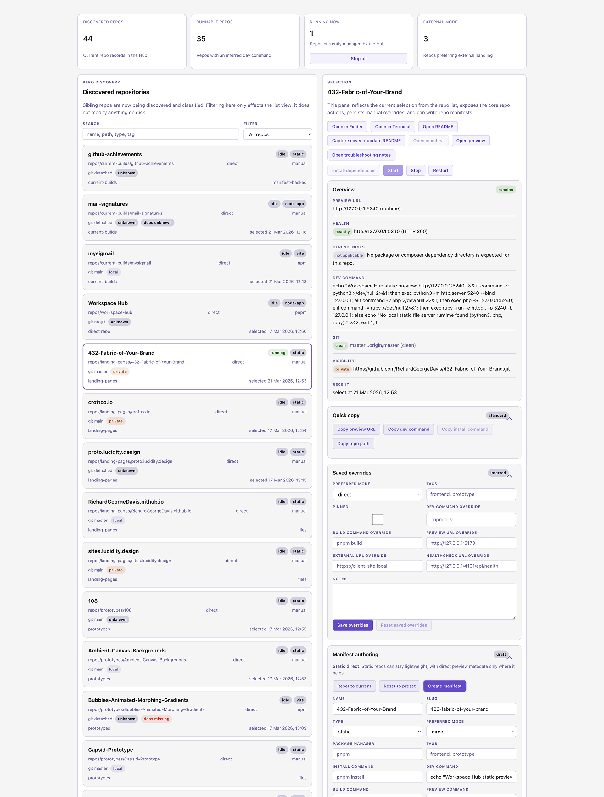

# Codex Workspace

<!-- workspace-hub:cover:start -->

<!-- workspace-hub:cover:end -->

Codex Workspace is a local-first workspace structure for managing many standalone repositories on one machine without forcing them into a monorepo.

It combines:

- a predictable folder layout for mixed stacks
- shared caches and helper tooling
- lightweight workspace metadata
- a vendored [Workspace Hub](repos/workspace-hub/README.md) app for discovery, runtime control, and previews

## Why It Exists

This repo exists to keep local development practical when your machine contains many unrelated repos.

- repos stay independently runnable
- caches can be shared without sharing installs
- local runtime behaviour stays explicit
- WordPress, Vite, static, PHP, and utility repos can coexist cleanly
- ServBay remains optional rather than becoming a hard dependency

## Core Principles

- Do not merge unrelated repos into one dependency structure.
- Share caches, not installs.
- Treat each repo as independently runnable.
- Prefer direct local runtime for frontend and dev-server projects.
- Keep WordPress handling pragmatic.
- Use lightweight manifests where explicit runtime behaviour helps.

## Workspace Layout

```text
Codex Workspace/
├── docs/
├── repos/
│   └── workspace-hub/
├── tools/
├── cache/
├── shared/
└── workspace.code-workspace
```

`docs/` is the canonical documentation surface.
`shared/` is for workspace metadata such as [`shared/repo-index.json`](shared/repo-index.json) and [`shared/standards.md`](shared/standards.md), not duplicated doc mirrors.

## Quick Start

Review the docs index:
- [docs/README.md](docs/README.md)

Run the local dashboard:

```bash
cd repos/workspace-hub
pnpm install
pnpm dev
```

Use the starter files when you need explicit repo metadata:
- [project-manifest.template.json](project-manifest.template.json)
- [repo-index.sample.json](repo-index.sample.json)

## Documentation

Start here:
- [docs/README.md](docs/README.md)
- [docs/00-overview.md](docs/00-overview.md)
- [docs/01-codex-workspace-handover.md](docs/01-codex-workspace-handover.md)
- [docs/02-local-runtime-handover.md](docs/02-local-runtime-handover.md)
- [docs/03-workspace-hub-build-spec.md](docs/03-workspace-hub-build-spec.md)
- [docs/04-build-order-and-dod.md](docs/04-build-order-and-dod.md)
- [docs/05-examples-and-templates.md](docs/05-examples-and-templates.md)
- [docs/06-cross-agent-skills-and-mcp.md](docs/06-cross-agent-skills-and-mcp.md)

Supporting references:
- [docs/HANDOVER.md](docs/HANDOVER.md)
- [docs/CHANGELOG.md](docs/CHANGELOG.md)
- [AGENTS.md](AGENTS.md)
- [repos/workspace-hub/README.md](repos/workspace-hub/README.md)

## Workspace Hub

Workspace Hub is the most concrete product in this repo today. It scans sibling repos, classifies them conservatively, shows runtime and metadata state, and provides start, stop, open, and preview actions without forcing all repos into one toolchain.

See:
- [repos/workspace-hub/README.md](repos/workspace-hub/README.md)
- [repos/workspace-hub/docs/manifest.md](repos/workspace-hub/docs/manifest.md)
- [repos/workspace-hub/docs/runtime-troubleshooting.md](repos/workspace-hub/docs/runtime-troubleshooting.md)

## Community

- [LICENSE](LICENSE)
- [.github/CONTRIBUTING.md](.github/CONTRIBUTING.md)
- [.github/FUNDING.yml](.github/FUNDING.yml)
- [.github/CODE_OF_CONDUCT.md](.github/CODE_OF_CONDUCT.md)
- [.github/SECURITY.md](.github/SECURITY.md)
- [.github/SUPPORT.md](.github/SUPPORT.md)
- Support the work: [PayPal](https://www.paypal.com/donate/?hosted_button_id=Z9ET7KXE4MMZS)

## Current Focus

The immediate target is a strong local workspace structure plus a practical Workspace Hub v1, with optional ServBay integration and enough documentation to make the repo understandable to outside contributors.
